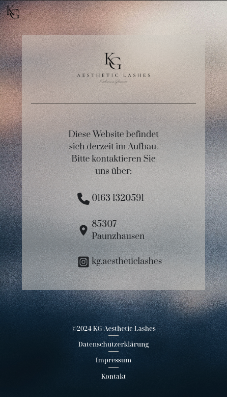

# KG Aesthetic Lashes

## Table of Contents

- [Overview](#overview)
- [Installation](#installation)
- [Built With](#built-with)
- [Features](#features)
- [Project Status](#status)
- [Contact](#contact)
- [Acknowledgements](#acknowledgements)

## Overview

<!-- TODO: Add a screenshot of the live project.
    1. Link to a 'live demo.'
    2. Describe your overall experience in a couple of sentences.
    3. List a few specific technical things that you learned or improved on.
    4. Share any other tips or guidance for others attempting this or something similar.
 -->

The purpose of this project is to create a website for a small business named KG Aesthetic Lashe, to practice and showcase the following self-taught technologies:

- UI Design
- Frontend development with React, TypeScript, and SCSS

The main functionalities of the website is to present business-related data, such as services offered, price list, and contact information.

You can check the live website here: [KG Aesthetic Lashes](https://www.kg-lashes.de/)

#### UI Example 1 - Figma Prototypes

#### UI Example 2 - Under Construction Page (Desktop)

#### UI Example 3 - Under Construction Page (Tablet)

#### UI Example 4 - Under Construction Page (Mobile)

## Installation

Run `npm install` to install necessary packages to run the application.

Once installation is completed, run `npm start` to startup the application locally.

## Built With

<!-- TODO: List any MAJOR libraries/frameworks (e.g. React, Tailwind) with links to their homepages. -->

- [React](https://react.dev/)
- [TypeScript](https://www.typescriptlang.org/)
- [Sass](https://sass-lang.com/)
- [React Bootstrap](https://react-bootstrap.netlify.app/)
- [React Router](https://reactrouter.com/en/main)
- [Git](https://git-scm.com/)
- [Github](https://github.com/)

## Features

<!-- TODO: List what specific 'user problems' that this application solves. -->

#### Landing Page

The main page that is loaded when end-users access the website. It includes logo and preview for some of the subfeatures such as 'Uber Mich', 'Was Biete Ich', and 'FAQs'.

#### Uber Mich

Introduction page for the business owner (Katharina Gleixner).

#### Was Biete Ich

Introduction page for the business and provided services.

#### Preisliste

Price list page.

#### FAQs

Frequently asked questions.

#### Gallery

Gallery with photos.

#### Kontakt

Contact page with a form that sends an email.

## Project Status

The project is currently on-going. The first version "Under Construction" went live on April 3rd, 2024.

The second version, the fully-functioning website is scheduled to be released in May, 2024.

## Contact

- [Email](mailto:clara.klaerner@gmail.com)
- [LinkedIn](https://www.linkedin.com/in/hyunji-clara-lee/)
- [Portfolio](https://www.clara-lee.net/)
